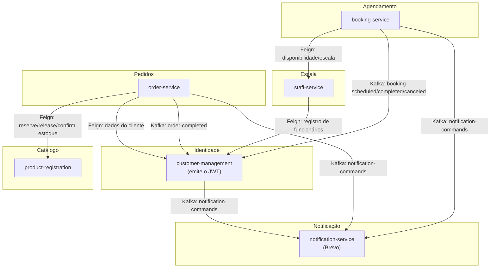
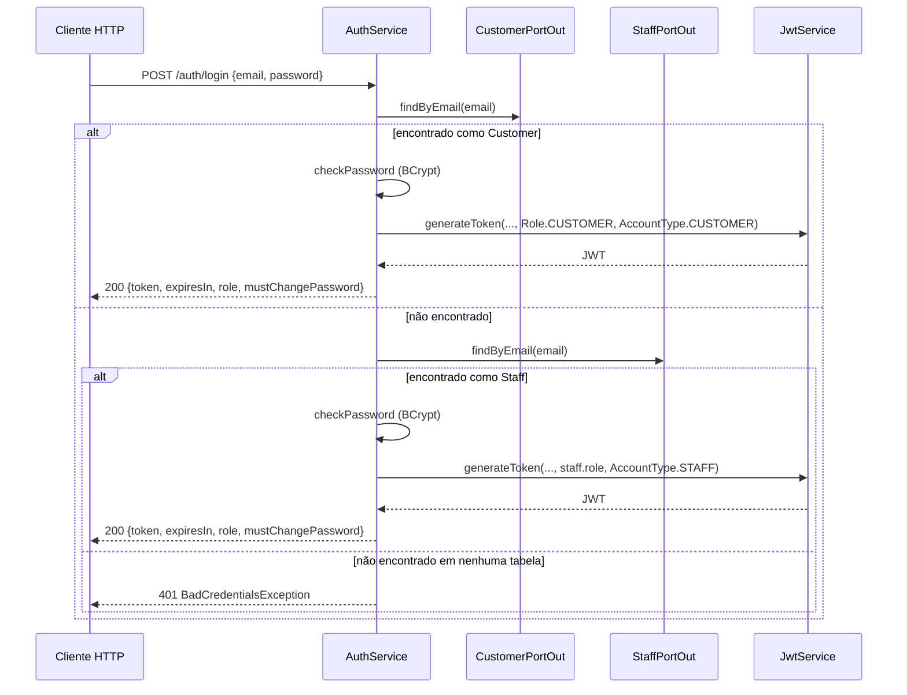
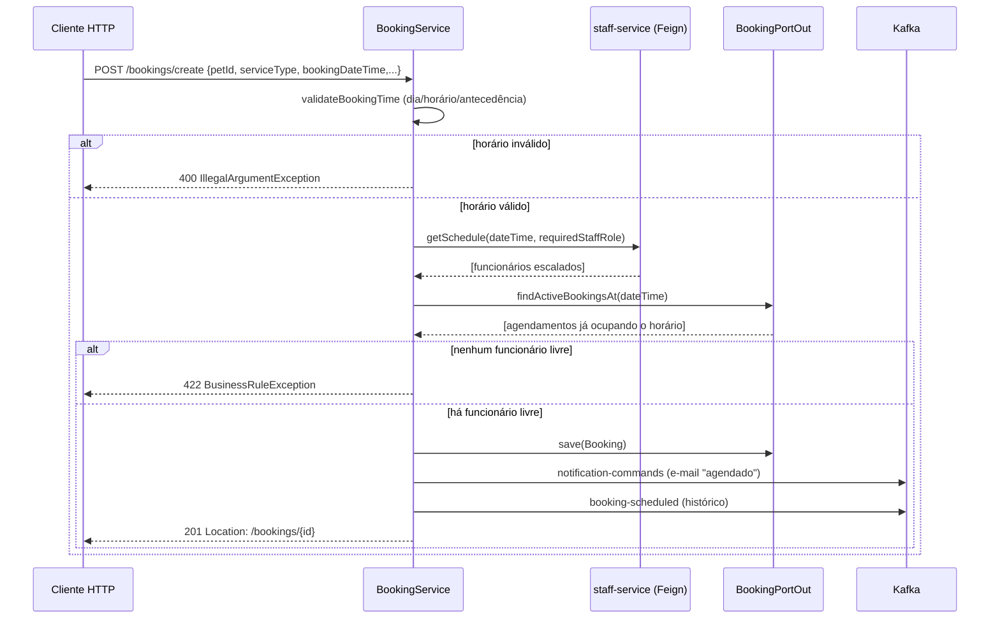
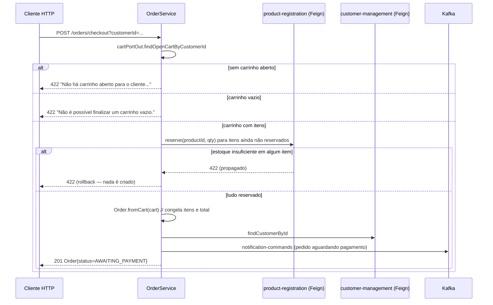
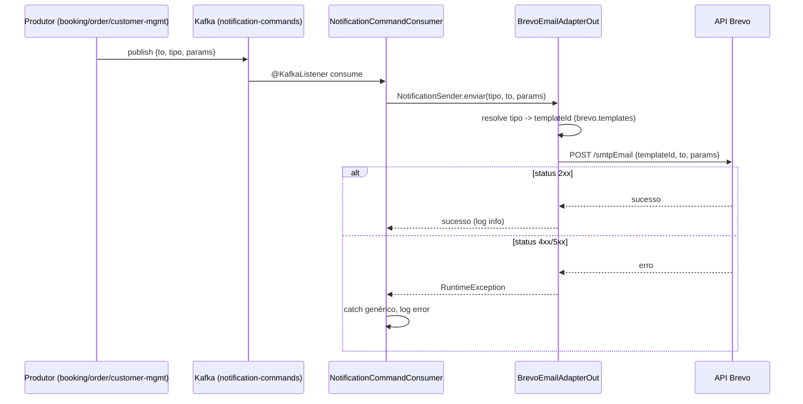

# Documentação Técnica — WebCommerce PetShop

> Público-alvo: desenvolvedores novos no projeto e revisores externos, sem
> conhecimento prévio do código. Este documento explica o que o sistema
> resolve, como os serviços se comunicam, o que cada módulo faz por dentro,
> e como os fluxos de negócio se comportam no caminho feliz e nos erros.
> Cada README de módulo (`<serviço>/README.md`) traz a referência rápida de
> configuração/endpoints; este documento foca em explicar o *porquê* e o
> *como* por trás do código.

## Índice

1. [Visão geral do sistema](#1-visão-geral-do-sistema)
2. [Arquitetura](#2-arquitetura)
3. [Módulos](#3-módulos)
4. [Cenários de funcionamento](#4-cenários-de-funcionamento)
5. [Configuração e variáveis de ambiente](#5-configuração-e-variáveis-de-ambiente)
6. [Como rodar localmente](#6-como-rodar-localmente)
7. [Como testar](#7-como-testar)

---

## 1. Visão geral do sistema

O WebCommerce PetShop é um sistema de e-commerce e agendamento de serviços
para um petshop, construído como projeto de estudo de arquitetura de
microsserviços em Java/Spring Boot. Não tem deploy público — o objetivo é
simular, de ponta a ponta, os problemas reais de um sistema distribuído:
múltiplos bancos de dados, comunicação síncrona e assíncrona entre
serviços, autenticação compartilhada, testes de integração e CI.

O sistema cobre dois fluxos de negócio independentes:

- **Venda de produtos** — catálogo, carrinho, checkout, pagamento simulado
  e retirada em loja (`product-registration` + `order-service`).
- **Agendamento de serviços** — banho, tosa e consulta veterinária, com
  checagem de disponibilidade de funcionários e escala rotativa de sábado
  (`booking-service` + `staff-service`).

Esses dois fluxos compartilham a mesma base de identidade
(`customer-management`, que cadastra clientes/pets/funcionários e emite o
token usado em todo o sistema) e o mesmo canal de notificação por e-mail
(`notification-service`).

Não existe front-end neste repositório: o sistema é consumido via API REST
(mais um consumidor Kafka puro, no caso das notificações).

---

## 2. Arquitetura

### 2.1 Serviços e portas

| Serviço | Responsabilidade | Porta | Banco |
|---|---|---|---|
| `customer-management` | Identidade: clientes, pets, funcionários, login/JWT, histórico | `8082` | PostgreSQL + MongoDB |
| `product-registration` | Catálogo e controle de estoque | `8081` | MongoDB |
| `staff-service` | Disponibilidade e escala de funcionários | `8085` | PostgreSQL |
| `booking-service` | Agendamento de serviços | `8083` | PostgreSQL |
| `order-service` | Carrinho, checkout, pagamento simulado | `8086` | PostgreSQL |
| `notification-service` | Envio de e-mail (Brevo, templates gerenciados no Brevo) | `8084` | — |
| `petshop-commons` | Biblioteca compartilhada (JWT, tratamento de erro) | — (JAR) | — |

### 2.2 Diagrama de componentes



Todos os serviços (exceto `notification-service`, que não expõe recurso
protegido) validam o mesmo JWT via `petshop-commons`; só o
`customer-management` o emite. Chamadas síncronas usam **OpenFeign** (sem
service discovery — URL estática por variável de ambiente); eventos
assíncronos usam **Kafka** (`SASL_PLAINTEXT`, um usuário por
serviço produtor/consumidor).

### 2.3 Modelo de autenticação

Não há Keycloak/OAuth2 (uma fase anterior do projeto usava, mas foi
substituída). O esquema é um JWT próprio, assinado com HMAC-SHA256
(`io.jsonwebtoken`), implementado em `petshop-commons`:

- **`JwtService.generateToken`** — emite o token de usuário, com claims
  `email`, `name`, `cpf`, `phone`, `role`, `type`. Só o
  `customer-management` chama este método (via `AuthService`).
- **`JwtService.generateServiceToken`** — emite um token de
  serviço-a-serviço (`Role.SERVICE`, `AccountType.SERVICE`) assinado
  localmente com o mesmo segredo, sem round-trip de rede. Usado em dois
  padrões distintos, cada um implementado num `RequestInterceptor` Feign
  próprio do serviço chamador:
  - **Relay-com-fallback** (`order-service/FeignAuthConfig`,
    `booking-service/FeignTokenRelayConfig`): repassa o `Authorization` da
    requisição HTTP em curso, se houver; sem requisição em andamento (ex.:
    um `@Scheduled`), assina um token de serviço local.
  - **Sempre serviço** (`staff-service/FeignTokenRelayConfig`, ao consultar
    `GET /staff/all` no `customer-management`): nunca repassa o token de
    quem originou o pedido, mesmo havendo um em andamento. Necessário
    porque essa consulta é sempre de sistema ("quem é staff e qual o
    cargo") — se relayasse o token de um `CUSTOMER` agendando um banho, a
    chamada cairia numa rota que exige `ADMIN`/`SERVICE`, e um cliente
    nunca tem essa role.
- **`JwtAuthenticationFilter`** — filtro `OncePerRequestFilter` presente em
  todo serviço: extrai o header `Authorization: Bearer <token>`, valida a
  assinatura e povoa o `SecurityContext` com um `AuthenticatedUser`. Token
  ausente/inválido não interrompe a requisição aqui — só deixa o contexto
  vazio, e cada `SecurityConfig` decide se a rota exige autenticação.

Papéis de negócio (`Role`): `ADMIN`, `RECEPTIONIST`, `GROOMER`,
`VETERINARIAN`, `CUSTOMER`, `SERVICE`. Tipo de conta (`AccountType`):
`CUSTOMER`, `STAFF`, `SERVICE` — usado para diferenciar "é um cliente" de
"é um funcionário" mesmo quando o papel de negócio seria compatível.

O segredo (`JWT_SECRET`, mínimo 32 bytes) precisa ser **idêntico** em todos
os serviços — é a única coisa que amarra a confiança entre eles; não há
troca de chave pública nem introspecção remota de token.

---

## 3. Módulos

### 3.1 `petshop-commons`

Não é um serviço — é um JAR consumido por todos os demais módulos Maven
(precisa ser instalado no `.m2` local antes de qualquer outro build; o
`mvn clean install` a partir do `pom.xml` agregador na raiz cuida disso
automaticamente — ver [6](#6-como-rodar-localmente)).

**Principais classes:**
- `JwtService` / `JwtAuthenticationFilter` / `AuthenticatedUser` — descritos
  acima.
- `Role`, `AccountType` — enums de domínio compartilhados.
- `BaseExceptionHandler` — classe abstrata estendida pelo
  `@RestControllerAdvice` de cada serviço. Centraliza a tradução de
  exceção → resposta HTTP no formato `ProblemDetail` (RFC 7807):

  | Exceção | Status | Observação |
  |---|---|---|
  | `NotFoundException` | 404 | Recurso não encontrado |
  | `ConflictException` | 409 | Ex.: CPF já cadastrado |
  | `BusinessRuleException` | 422 | Regra de negócio violada (estoque insuficiente, sem funcionário disponível...) |
  | `MethodArgumentNotValidException` | 400 | Bean Validation — lista de erros por campo em `problem.errors` |
  | `AccessDeniedException` | 403 | Autenticado, mas sem permissão |
  | `BadCredentialsException` | 401 | Login/senha inválidos |
  | `IllegalArgumentException` | 400 | Parâmetro inválido (ex.: horário de agendamento fora da regra) |
  | `MaxUploadSizeExceededException` | 413 | Upload multipart acima do limite configurado (`spring.servlet.multipart.*`) |
  | `Exception` (genérica) | 500 | Fallback — logada como erro, mensagem genérica ao cliente |

  Isso significa que **toda** `IllegalArgumentException`/`BusinessRuleException`
  lançada em qualquer camada de domínio (ver `BookingService.validateBookingTime`,
  `ProductService.reserveStock` etc.) já vira automaticamente uma resposta
  HTTP correta, sem tratamento repetido em cada controller.
- `NotFoundException`, `ConflictException`, `BusinessRuleException`,
  `BusinessException` — exceções de negócio que a camada de aplicação lança.

### 3.2 `customer-management`

Serviço central de identidade. Dono dos dados de cliente, pet e
funcionário; único serviço que emite JWT; mantém o histórico consultável
(read model) de agendamentos e compras.

**Persistência:** PostgreSQL (`clientes_db`) para clientes/pets/staff via
JPA; MongoDB (`customer_history_db`) para o histórico, alimentado por
eventos Kafka — não por escrita direta de outro serviço.

**Principais classes:**
- `AuthService` — login, esqueci-senha, troca de senha. Ver
  [4.1](#41-login) e [4.2](#42-recuperação-de-senha).
- `CustomerService` — CRUD de cliente e pets. Ver [4.3](#43-cadastro-de-cliente).
- `StaffService` — CRUD de funcionário (só `ADMIN`; é o registro que o
  `staff-service` consulta via Feign para calcular disponibilidade).
  `GET /staff/all` lista só os habilitados (`enabled=true` — desligados
  não somem do banco, só param de aparecer na listagem, mesmo soft-delete
  de `deleteStaff`) e aceita role `ADMIN` **ou** `SERVICE` — essa segunda
  role é quem o `staff-service` usa de verdade (ver [2.3](#23-modelo-de-autenticação)),
  já que um `CUSTOMER` agendando um serviço nunca tem `ADMIN`. `GET /staff/{id}/find` e
  `GET /customers/find/customer/{id}` aceitam **id ou CPF** no mesmo
  parâmetro: tenta interpretar como UUID e buscar por id primeiro, se não
  for um UUID válido (ou não achar) cai para busca por CPF
  (`getStaffByIdOrCpf`/`findCustomerByIdOrCpf`). No caso do cliente, a
  checagem de ownership (`CustomerIdentityResolver`) só acontece **depois**
  de resolver o registro — precisa saber o id real por trás do CPF antes de
  comparar com o dono do token. `PATCH /staff/{id}/reactivate` reverte o
  soft-delete (`enabled=true` de novo, volta a aparecer em `GET /staff/all`).
- `HistoryService` — leitura do histórico (agendamentos/compras),
  alimentado pelos `@KafkaListener`s abaixo.
- `BookingHistoryKafkaListener` / `OrderHistoryKafkaListener` — consomem
  `booking-completed` e `order-completed`, traduzem o DTO de mensageria
  para um command do core (`BookingCompletedCommand`,
  `PurchaseCompletedCommand`) e delegam a
  `UpdateBookingHistoryUseCase`/`UpdateCustomerPurchaseHistoryUseCase`, que
  gravam/atualizam o documento Mongo correspondente.
  `UpdateBookingHistoryUseCase.execute` é `@Transactional(readOnly = true)`
  — precisa manter a sessão Hibernate aberta enquanto resolve o cliente
  por CPF (`CustomerPortOut.findByCpf`), já que o mapper acessa a coleção
  lazy de pets; sem isso (bug encontrado e corrigido nesta sessão), a
  sessão fechava assim que o método de busca retornava e a leitura da
  coleção lazy explodia com `LazyInitializationException` — mascarado em
  qualquer fluxo disparado por HTTP graças ao `spring.jpa.open-in-view`
  (default `true`), mas fatal para um `@KafkaListener`, que não tem
  requisição HTTP nenhuma por trás.
- `KafkaConsumerConfig` — cada listener acima tem sua própria
  `ConcurrentKafkaListenerContainerFactory` (não a default que o Boot
  monta a partir de `spring.kafka.consumer.*`), com um `JsonDeserializer`
  construído já com o tipo-alvo fixo (`BookingEventDTO`/
  `OrderCompletedEventDTO`) e embrulhado em `ErrorHandlingDeserializer`.
  Dois motivos pra isso, achados nesta sessão ao investigar uma mensagem
  presa no dead-letter-topic:
  1. **Header de tipo desligado dos dois lados** (`spring.json.use.type.headers:
     false` no consumer daqui, `spring.json.add.type.headers: false` no
     producer de quem publica) é proposital — cada serviço tem sua própria
     classe de DTO pro mesmo evento (decisão consciente de não compartilhar
     classes de evento entre serviços), então o nome de classe no header de
     quem produziu não faria sentido aqui. Só que isso deixa o
     `JsonDeserializer` sem NENHUMA forma de saber o tipo-alvo a menos que
     seja fixado em código — sem isso, **toda** mensagem (não só payload
     inválido) falhava com `"No type information in headers and no default
     type provided"` e ia pro DLT à toa.
  2. Como os dois tópicos (`booking-completed`, `order-completed`) precisam
     de tipos diferentes, uma única factory genérica não serve pros dois —
     daí uma factory por tópico, cada uma com seu tipo fixo.

  A proteção contra "poison pill" continua vindo do
  `ErrorHandlingDeserializer` (embrulhando o `JsonDeserializer` de cada
  factory) + `KafkaErrorHandlingConfig` (`DefaultErrorHandler` injetado nas
  duas factories): um payload que não desserializa vira
  `DeserializationException`, tratada com retry + `DeadLetterPublishingRecoverer`
  publicando no tópico `.DLT`, sem travar o `poll()` nem o consumo dos
  próximos registros. Diferente do `notification-service` (ver
  [3.7](#37-notification-service)), que ainda não tem essa proteção.
- `BootstrapAdminRunner` — `ApplicationRunner` que roda no start: se a
  tabela de staff estiver vazia, cria um `ADMIN` inicial com senha aleatória
  de 20 caracteres (ou `BOOTSTRAP_ADMIN_PASSWORD`, se configurada), logada
  **uma única vez** e com `mustChangePassword=true`.

**Fluxo de dados típico (histórico de agendamento):**

```
booking-service publica "booking-completed" (Kafka)
  → BookingHistoryKafkaListener.consumeBookingEvent
  → traduz BookingEventDTO → BookingCompletedCommand
  → UpdateBookingHistoryUseCase.execute
  → BookingHistoryPortOut (Mongo) grava/atualiza CustomerHistoryBookings
```

### 3.3 `product-registration`

Catálogo de produtos e controle de estoque. Não chama nenhum outro
serviço — é consumido via REST direto pelo `order-service`.

**Persistência:** MongoDB (`produtos_db`, banco compartilhado com
`customer-management` na mesma instância — cada um com seu próprio banco
lógico), documento `ProductDocument` (`infrastructure/persistence/mongo`)
mapeado de/para o domínio `Product` via `ProductMapper` (MapStruct). Migrado
de PostgreSQL nesta sessão — o `id` continua `Long` (não `ObjectId`), já que
`order-service` e o resto do sistema referenciam produto por `Long id`;
`ProductSequenceGenerator` emula auto-increment via contador atômico
(`findAndModify` + `$inc`) numa coleção auxiliar `database_sequences`, já
que o Mongo não tem `IDENTITY`/`SERIAL` nativo. Índice único em `name`
precisa de `spring.data.mongodb.auto-index-creation: true` pra ter efeito
de verdade (Spring Data não cria índice a partir de `@Indexed` sozinho).

**Principais classes:**
- `ProductService` (implementa `ProductPortIn`) — CRUD de produto e as três
  operações de estoque: `reserveStock`, `releaseStock`, `confirmStock`.
- `Product` (domínio) — mantém `stock` (físico) e `reservedStock`
  (comprometido por carrinhos ainda não pagos); `availableStock()` é
  `stock - reservedStock`; `reservedPercentage()` é
  `reservedStock / stock * 100` (`0` se `stock` for `0`, evita divisão por
  zero). `reserve`/`release`/`confirmSale` são métodos do próprio domínio,
  não da service.
- `GET /list` e `GET /find/{id}` aceitam token **opcional**: o
  `JwtAuthenticationFilter` (petshop-commons) roda em toda requisição e
  popula o `AuthenticatedUser` sempre que vem um Bearer válido, mesmo em
  endpoint `permitAll()`. O `ProductController` só inclui
  `stock`/`reservedStock`/`availableStock`/`reservedPercentage` no
  `ProductResponseDto` quando `user != null && user.type() ==
  AccountType.STAFF` — sem token ou com token de `CUSTOMER`, esses 4 campos
  saem do JSON (`@JsonInclude(NON_NULL)` no DTO, não aparecem nem como
  `null`).

**Fluxo de dados (ciclo de vida do estoque de um item):**

```
order-service: item adicionado ao carrinho (autenticado)
  → POST /api/v1/products/{id}/reserve
  → Product.reserve(qty)          // reservedStock += qty
                                    // availableStock cai, stock não muda

  (a) item removido do carrinho / carrinho expira
      → POST /{id}/release  → Product.release(qty)   // reservedStock -= qty

  (b) pagamento confirmado
      → POST /{id}/confirm  → Product.confirmSale(qty) // stock -= qty, reservedStock -= qty
```

### 3.4 `staff-service`

Não é dono do cadastro de funcionários — isso vive no
`customer-management`. Consulta esse registro via Feign e, em cima dele,
calcula disponibilidade e mantém a escala rotativa de sábado.

**Persistência:** PostgreSQL (`staff_db`) — usado **só** para
`WeekendAllocation` (a escala de sábado). `Staff` não é uma entidade
persistida localmente: é um objeto de domínio populado a cada chamada a
partir do Feign.

**Principais classes:**
- `AvailabilityService` — calcula, para um `dateTime`/`Role`, se há
  funcionário disponível e quem está escalado. Regras fixas: cada
  atendimento ocupa 30 minutos (`dateTime` precisa cair num slot exato);
  segunda a sexta, 9h–17h com almoço 12h–13h, todo `GROOMER`/`VETERINARIAN`
  habilitado atende; sábado 8h–11h só existe para `GROOMER` e só quem está
  na `WeekendAllocation` daquele sábado; domingo fechado para todos.
- `WeekendAllocationService.generateNextMonth` — gera, em rodízio round-robin
  (`cursor % groomers.size()`), a escala dos sábados do **próximo mês ainda
  não preenchido** (`nextMonthToFill()` olha a última data já alocada).
- `StaffRegistryFeign` — chama `GET /api/v1/staff/all` no
  `customer-management`. `FeignTokenRelayConfig` aqui **sempre** assina um
  token de serviço (nunca repassa o token de quem originou a chamada) — ver
  o padrão "sempre serviço" em [2.3](#23-modelo-de-autenticação).

**Fluxo de dados (checar disponibilidade):**

```
booking-service → GET /api/v1/availability/general?dateTime=...&role=GROOMER
  → AvailabilityService.checkGeneralAvailability
  → staffPortOut.findAll()  (Feign → customer-management GET /api/v1/staff/all)
  → filtra Staff habilitado + role == GROOMER
  → se sábado: cruza com WeekendAllocationPortOut.findByDate(sábado)
  → devolve AvailabilityResult(capacity, available, dateTime)
```

### 3.5 `booking-service`

Agendamento de serviços (banho, tosa, consulta veterinária): criação,
listagem, atualização, cancelamento e cálculo de horários disponíveis.

**Persistência:** PostgreSQL (`booking_db`, `pet-service_db` no valor
padrão de dev) via JPA.

**Principais classes:**
- `BookingService` (implementa `BookingPortIn`) — toda a regra de negócio
  de agendamento. Ver [4.4](#44-criação-de-agendamento).
- `Booking` (domínio) — estado (`SCHEDULED`/`COMPLETED`/`CANCELED`),
  `completeBooking` só permite a transição a partir de `SCHEDULED`.
- `ServiceType` (enum) — `TOSAGEM`, `BANHO`, `TOSA_E_BANHO`,
  `CONSULTA_VETERINARIA`; `requiredStaffRole()` mapeia o serviço para o
  cargo do `staff-service` (`VETERINARIAN` para consulta, `GROOMER` para
  os demais).
- `CustomerManagementFeign` (o nome é histórico — na prática aponta para o
  `staff-service`, ver `external.api.staff-service.url`) — consulta
  `/api/v1/availability/general` e `/schedule`. `FeignTokenRelayConfig`
  segue o padrão "relay-com-fallback" ([2.3](#23-modelo-de-autenticação)):
  repassa o token de quem chamou quando há uma requisição HTTP em
  andamento, senão assina um token de serviço.
- Produtor Kafka: eventos de histórico (`booking-scheduled`,
  `booking-completed`, `booking-canceled`) e comandos de e-mail
  (`notification-commands`, payload `{to, tipo, params}` — sem HTML, o
  template é resolvido pelo `notification-service`). `to` é sempre o
  `ownerEmail` do agendamento (nunca `ownerContact`, que é telefone) —
  capturado do corpo da requisição (`RECEPTIONIST`/`ADMIN`) ou sobrescrito
  com a claim `email` do token quando quem agenda é o próprio `CUSTOMER`
  ([4.4](#44-criação-de-agendamento)).

**Fluxo de dados (criação de agendamento):** ver [4.4](#44-criação-de-agendamento).

### 3.6 `order-service`

Orquestra o fluxo completo de compra: carrinho com reserva de estoque,
checkout, pagamento simulado, retirada e histórico — coordenando
`product-registration` e `customer-management` via Feign.

**Persistência:** PostgreSQL (`order_db`) — `Cart`/`CartItem` e
`Order`/`OrderItem`.

**Principais classes:**
- `CartService` (implementa `CartPortIn`) — `addItem`, `removeItem`,
  `getCart`, `expireOldCarts`. Ver [4.5](#45-carrinho-e-checkout).
- `OrderService` (implementa `OrderPortIn`) — `checkout`,
  `processPendingPayments`, `processPickupReadyOrders`.
- `Cart` (domínio) — `openFor` cria um carrinho com TTL
  (`renewExpiration`); `isExpired()` compara `expiresAt` com `now()`.
- `Order` (domínio) — `fromCart` congela os itens/preço no momento do
  checkout; `markAsPaid`, `schedulePickup`, `markReadyForPickup` são
  transições de estado.
- `CartExpirationScheduler`, `PaymentMockScheduler`, `PickupReadyScheduler`
  — `@Scheduled` que disparam, respectivamente, `expireOldCarts`,
  `processPendingPayments` e `processPickupReadyOrders` em intervalos
  configuráveis.
- `ProductFeign` / `ProductStockAdapterOut` — `find/{id}`, `{id}/reserve`,
  `{id}/release`, `{id}/confirm` no `product-registration`.
- `FeignAuthConfig` — repassa o `Authorization` da requisição em curso
  (token relay); se não há requisição HTTP (chamada disparada por um
  scheduler), assina localmente um token de serviço
  (`jwtService.generateServiceToken("order-service")`) — sem round-trip de
  rede, porque o segredo já é compartilhado.

### 3.7 `notification-service`

Serviço fino, orientado a eventos: consome comandos de e-mail via Kafka e
os envia via Brevo, usando templates gerenciados no painel do Brevo (o
serviço não renderiza HTML). Sem API REST própria, sem persistência.

**Principais classes:**
- `NotificationCommandConsumer` — `@KafkaListener(topics =
  KafkaTopics.NOTIFICATION_COMMANDS, groupId = "notification-group")`;
  qualquer exceção no processamento é capturada e só logada (sem retry,
  sem dead-letter topic).
- `NotificationSender` (porta de saída, `enviar(TipoNotificacao,
  destinatarioEmail, variaveis)`) — implementada por `BrevoEmailAdapterOut`.
- `BrevoEmailAdapterOut` — resolve `TipoNotificacao` → `templateId` via
  `BrevoProperties.templates()` (`@ConfigurationProperties(prefix =
  "brevo")`, `Map<TipoNotificacao, Long>`) e chama `POST /smtpEmail` via
  `BrevoFeignClient` com o `templateId` e as `params` como variáveis do
  template — sem remetente/assunto/corpo no payload, fixos no template.

**Produtores conhecidos** do tópico `notification-commands` (todos
publicam o mesmo contrato `{to, tipo, params}` — `tipo` precisa bater com
uma constante de `TipoNotificacao`; só o `notification-service` sabe o
`templateId` correspondente): `order-service` (pedido aguardando
pagamento, pagamento confirmado, nota emitida, janela de retirada, pedido
pronto, carrinho abandonado), `booking-service` (agendamento
criado/concluído/cancelado) e `customer-management` (recuperação de
senha).

---

## 4. Cenários de funcionamento

### 4.1 Login

`POST /api/v1/auth/login` em `customer-management`, `AuthService.login`.



**Caminho feliz:** e-mail existe em `customer` ou `staff` (nunca nos dois —
constraints `unique` separadas) e a senha bate (`PasswordEncoder.matches`,
BCrypt). Resposta 200 com `LoginResponseDto{token, expiresIn, role,
accountType, mustChangePassword}`.

**Reativação automática (só Customer):** `checkPassword` não olha
`enabled` em nenhum dos dois casos — um Customer ou Staff desativado
consegue logar normalmente se a senha ainda bate. A diferença é o que
acontece **depois**: pro Customer, login bem-sucedido com `enabled=false`
(desativado via `DELETE /customers/delete/customer/{id}`, soft-delete)
reativa a conta automaticamente (`reactivateIfDisabled`, `enabled=true`
persistido antes de emitir o token) — não precisa de nenhuma ação do
ADMIN, só logar de novo com a senha que já tinha. Staff não tem esse
efeito colateral no login; a reativação lá é sempre manual, pelo ADMIN
(`PATCH /staff/{id}/reactivate`, ver [3.2](#32-customer-management)).

**Erros:**
- E-mail não encontrado em nenhuma tabela, ou senha errada →
  `BadCredentialsException("Invalid email or password.")` → **401**, via
  `BaseExceptionHandler`. A mensagem é sempre a mesma nos dois casos — não
  revela se o e-mail existe.
- Corpo inválido (e-mail vazio, sem `@`, etc.) → `MethodArgumentNotValidException`
  → **400** com lista de campos inválidos.

### 4.2 Recuperação de senha

`POST /api/v1/auth/forgot-password`, `AuthService.forgotPassword`.

**Caminho feliz:** cliente informa `email` **e** `cpf`; se os dois batem
com um registro (`customer` ou `staff`), `AuthService` gera uma senha
aleatória de 10 caracteres (sem `0/O/1/l/I`, para não confundir na
digitação), grava o hash, marca `mustChangePassword=true` e publica em
`notification-commands` (via `NotificationPortOut.sendPasswordReset`) um
comando `{to, tipo: "RESET_SENHA", params: {name, newPassword}}` — o
`notification-service` resolve o template Brevo e envia o e-mail com a
nova senha. Resposta **sempre 200**, com corpo vazio.

**Comportamento deliberado em caso de "erro":** se `email`+`cpf` não batem
com nada, o método simplesmente não faz nada — nenhuma exceção, nenhum
efeito colateral — e o controller ainda responde **200**. Isso é
intencional: impede que um atacante descubra, por tentativa e erro, se um
e-mail está cadastrado no sistema (enumeração de usuários).

### 4.3 Cadastro de cliente

`POST /api/v1/customers/register/customer`, `CustomerService.registerCustomer`.

**Caminho feliz:** CPF ainda não cadastrado → cria `Customer` com a senha
escolhida pelo próprio cliente no cadastro (`password`/`confirmPassword`
no `CustomerRequestDto`, hash via `PasswordEncoder`, nunca texto puro) —
`mustChangePassword=false`, já que a senha não é provisória. Diferente do
`Staff` (criado pelo `ADMIN`), que continua nascendo com senha = hash do
CPF e troca obrigatória no primeiro login (ver `StaffService`). Depois de
salvar, publica em `notification-commands` (via
`NotificationPortOut.sendRegistrationConfirmation`) um comando
`{to, tipo: "CADASTRO_CONFIRMADO", params: {name}}` — e-mail de boas-vindas
via Brevo, mesmo mecanismo assíncrono do reset de senha ([4.8](#48-envio-de-notificação-por-e-mail)).
Responde 201 com o cliente criado.

**Validação do `CustomerRequestDto`:** `password` exige mínimo de 6
caracteres; `confirmPassword` é validado contra `password` via
`@AssertTrue` no próprio DTO (`isConfirmPasswordMatching()`) — feito no
backend, não só no front, porque o cadastro é público e pode ser chamado
direto na API sem passar por nenhum formulário.

**Erro:**
```java
customerPortOut.findByCpf(request.getCpf())
        .ifPresent(c -> {
            throw new ConflictException("CPF already exists: " + request.getCpf());
        });
```
CPF já existente → `ConflictException` → **409**.

### 4.4 Criação de agendamento

`POST /api/v1/bookings/create`, `BookingService.createBooking`.



**Regras de horário (`validateBookingTime`):**
- Domingo: loja fechada, para qualquer serviço.
- `CONSULTA_VETERINARIA` aos sábados: não atende.
- Segunda a sexta: 9h–17h, com intervalo de almoço 12h–13h bloqueado.
- Sábado (exceto consulta): 8h–11h.
- Antecedência mínima de **2 horas** a partir de `now()`.
- Qualquer violação → `IllegalArgumentException` → **400**.

**Atribuição de funcionário
(`ensureAvailabilityAndAssignEmployee`):** cruza quem está escalado
(Feign para `staff-service`, já considerando cargo exigido pelo
`ServiceType` e o rodízio de sábado) com quem já está ocupado nesse exato
horário (`bookingPortOut.findActiveBookingsAt`), e pega o primeiro nome
livre. Se ninguém sobra → `BusinessRuleException("Não há funcionário
disponível para o horário selecionado: " + bookingDateTime)` → **422**.

**Efeitos colaterais no sucesso:** grava o `Booking` (`status =
SCHEDULED`), invalida o cache `availableSlots` (`@CacheEvict`), publica o
e-mail de confirmação (`notification-commands`) e o evento de histórico
(`booking-scheduled`) — se qualquer publicação falhar, a transação de
banco **não é desfeita** por causa disso (a chamada acontece depois do
`save`, dentro do mesmo método `@Transactional`, mas o Kafka não participa
da transação JPA).

**Regra de identidade:** se quem chama é `CUSTOMER`
(`BookingControllerImpl.applyOwnerIdentity`), nome/CPF/contato/e-mail do
dono são sobrescritos com as claims do próprio token — o corpo da
requisição é ignorado nesses campos, então um cliente não consegue agendar
em nome de outro CPF (nem direcionar a notificação por e-mail pra outro
endereço). `RECEPTIONIST`/`ADMIN` usam o corpo como está.

**Conclusão de atendimento** (`PATCH .../{id}?status=COMPLETED`,
`Booking.completeBooking`): só sobrescreve `observations` se o
`BookingUpdateDto` trouxer o campo preenchido — finalizar um atendimento
sem passar observação nova preserva o que já tinha sido registrado durante
o serviço, em vez de apagar.

### 4.5 Carrinho e checkout

**Adicionar item** (`CartService.addItem`): se o cliente está autenticado,
reserva o estoque de imediato (`POST /products/{id}/reserve`); se não está
(carrinho anônimo, sem login), só consulta o produto sem reservar nada —
a reserva de fato acontece depois, no checkout
(`OrderService.ensureAllItemsReserved`).

**Checkout** (`POST /api/v1/orders/checkout?customerId=`,
`OrderService.checkout`):



**Pagamento simulado** (`PaymentMockScheduler`, a cada
`order.payment.check-interval-ms`, padrão 10s):
`OrderService.processPendingPayments` aprova qualquer pedido
`AWAITING_PAYMENT` criado há mais de `order.payment.mock-delay-seconds`
(padrão 30s) atrás — como se fosse um webhook assíncrono de gateway real.
Isso `confirm`a o estoque no `product-registration` (baixa definitiva),
sorteia um prazo de preparo entre `order.pickup.min/max-delay-minutes`
(padrão 1–60 min, propositalmente curto para acelerar o teste), envia três
e-mails (pagamento confirmado, nota emitida, janela de retirada) e publica
`order-completed` (para o histórico de compras no `customer-management`).

**Retirada** (`PickupReadyScheduler`): quando `pickupReadyAt` vence, o
pedido vira `READY_FOR_PICKUP` e dispara o e-mail de aviso.

### 4.6 Expiração de carrinho abandonado

`CartExpirationScheduler` chama `CartService.expireOldCarts` a cada
`order.cart.expiration-check-interval-ms` (padrão 10 min). Para todo
carrinho `OPEN` com `expiresAt` no passado
(`order.cart.reservation-ttl-hours`, padrão 24h):

1. Libera (`release`) o estoque reservado de cada item que estava
   reservado.
2. Marca o carrinho como `EXPIRED`.
3. Se o carrinho tinha itens, dispara e-mail de lembrete de carrinho
   abandonado — **só** se `customerId` corresponder a um cliente
   cadastrado de verdade; carrinho anônimo (nunca logou) apenas gera um log
   de aviso, sem e-mail (não haveria destinatário).

### 4.7 Geração de escala de sábado

`POST /api/v1/weekend-allocation/generate` (`ADMIN`),
`WeekendAllocationService.generateNextMonth`.

**Caminho feliz:** busca todo `Staff` com `role == GROOMER` e `enabled ==
true` (via Feign, ordenado por id para o rodízio ser determinístico),
descobre o próximo mês ainda sem escala
(`weekendAllocationPortOut.findLastAllocatedDate` + 1 mês, ou o mês atual
se nunca gerou nada) e distribui `staff.groomer.saturday-staff-count`
(padrão 2) tosadores por sábado daquele mês, em rodízio round-robin a
partir de um cursor cumulativo (`weekendAllocationPortOut.countAll()`) —
para o rodízio continuar de onde parou entre execuções, não recomeçar do
zero todo mês.

**Erro:** menos tosadores habilitados do que
`staff.groomer.saturday-staff-count` → `BusinessRuleException` → **422**,
nenhuma alocação é criada.

### 4.8 Envio de notificação por e-mail



**Ponto importante:** não há retry nem dead-letter topic. Se o envio falhar
(Brevo fora do ar, chave inválida, `templateId` não encontrado), o
`NotificationCommandConsumer` captura a exceção, loga e segue — a mensagem
Kafka é considerada consumida (offset avança) mesmo assim. Sem
`BREVO_API_KEY`/`BREVO_TEMPLATE_*` configurados, o serviço sobe
normalmente e todo envio falha silenciosamente (só logado).

---

## 5. Configuração e variáveis de ambiente

Variáveis comuns a (quase) todos os serviços:

| Variável | Descrição |
|---|---|
| `JWT_SECRET` | Segredo HS256 compartilhado — **precisa ser idêntico** em todos os serviços. Mínimo 32 bytes; sem valor, `JwtService` lança `IllegalStateException` no boot. |
| `JWT_EXPIRATION_MINUTES` | Validade do token (padrão `60`) |
| `SPRING_DATASOURCE_URL` / `_USERNAME` / `_PASSWORD` | Conexão PostgreSQL (todos exceto `notification-service`) |
| `SPRING_KAFKA_BOOTSTRAP_SERVERS` | Broker Kafka (`customer-management`, `booking-service`, `order-service`, `notification-service`) |

Variáveis específicas relevantes:

| Serviço | Variável | Padrão | Descrição |
|---|---|---|---|
| `customer-management` | `SPRING_DATA_MONGODB_URI` | — | URI do Mongo (histórico) |
| `customer-management` | `BOOTSTRAP_ADMIN_EMAIL` / `_PASSWORD` / ... | `admin@petshop.local` / vazio (gera aleatória) | Admin criado no primeiro start |
| `booking-service` | `EXTERNAL_API_STAFF_SERVICE_URL` | `http://localhost:8085` | URL do staff-service (Feign) |
| `staff-service` | `EXTERNAL_API_CUSTOMER_MANAGEMENT_URL` | `http://localhost:8082` | URL do customer-management (Feign) |
| `staff-service` | `STAFF_GROOMER_SATURDAY_COUNT` | `2` | Tosadores escalados por sábado |
| `order-service` | `EXTERNAL_API_PRODUCT_SERVICE_URL` / `_CUSTOMER_SERVICE_URL` | `:8081` / `:8082` | URLs Feign |
| `order-service` | `order.cart.reservation-ttl-hours` | `24` | TTL do carrinho |
| `order-service` | `order.payment.mock-delay-seconds` | `30` | Delay simulado de aprovação de pagamento |
| `order-service` | `order.pickup.min/max-delay-minutes` | `1` / `60` | Janela simulada até "pronto para retirada" |
| `notification-service` | `BREVO_API_KEY` / `BREVO_TEMPLATE_*` (10 vars) | vazio | Sem isso, envios falham silenciosamente |
| `*` (Kafka) | `KAFKA_<SERVIÇO>_USERNAME` / `_PASSWORD` | — | Credenciais SASL/PLAIN por serviço produtor/consumidor |

A lista completa e detalhada por serviço está no README de cada módulo
(seção "Configuração"), e um `.env` de exemplo pronto para
`docker compose up` está descrito na seção seguinte.

---

## 6. Como rodar localmente

### Docker Compose (recomendado)

1. Crie um `.env` na raiz do repositório (não versionado):

   ```env
   POSTGRES_USER=postgres
   POSTGRES_PASSWORD=postgres
   JWT_SECRET=uma-chave-de-pelo-menos-32-bytes-aqui
   JWT_EXPIRATION_MINUTES=15
   KAFKA_BOOKING_USERNAME=booking
   KAFKA_BOOKING_PASSWORD=booking123
   KAFKA_ORDER_USERNAME=order
   KAFKA_ORDER_PASSWORD=order123
   KAFKA_CUSTOMER_USERNAME=customer
   KAFKA_CUSTOMER_PASSWORD=customer123
   KAFKA_NOTIFICATION_USERNAME=notification
   KAFKA_NOTIFICATION_PASSWORD=notification123
   BREVO_API_KEY=xkeysib-xxxx
   BREVO_TEMPLATE_BOOKING_SCHEDULED=1
   BREVO_TEMPLATE_BOOKING_COMPLETED=2
   BREVO_TEMPLATE_BOOKING_CANCELED=3
   BREVO_TEMPLATE_ORDER_AWAITING_PAYMENT=4
   BREVO_TEMPLATE_PAYMENT_CONFIRMED=5
   BREVO_TEMPLATE_INVOICE_ISSUED=6
   BREVO_TEMPLATE_PICKUP_WINDOW=7
   BREVO_TEMPLATE_ORDER_READY_FOR_PICKUP=8
   BREVO_TEMPLATE_CART_REMINDER=9
   BREVO_TEMPLATE_PASSWORD_RESET=10
   ```

2. Suba tudo:

   ```bash
   docker compose up --build
   ```

   Serviços expostos: `8081` produtos, `8082` clientes, `8083`
   agendamentos, `8084` notificações, `8085` staff, `8086` pedidos;
   Postgres em `5432`, MongoDB em `27017`, Kafka (listener externo) em
   `9094`.

### Rodando um serviço individualmente

O `pom.xml` na raiz é um agregador só de orquestração de build
(`packaging=pom`, sem `<parent>` — cada serviço continua herdando
`spring-boot-starter-parent` diretamente, Maven só permite um `<parent>`
por módulo). `mvn clean install` a partir da raiz builda os 7 módulos na
ordem certa (Maven resolve pelo grafo de `<dependency>` do reactor),
incluindo instalar `petshop-commons` no `.m2` local antes dos demais —
não é preciso fazer isso manualmente:

```bash
mvn clean install          # a partir da raiz do repositório
cd <algum-servico>
./mvnw spring-boot:run
```

Se preferir buildar só `petshop-commons` e um serviço específico (sem
passar pelos outros 6), o passo manual antigo ainda funciona:

```bash
cd petshop-commons && ./mvnw clean install
cd ../<algum-servico>
./mvnw spring-boot:run
```

Requer PostgreSQL/MongoDB/Kafka acessíveis conforme as variáveis daquele
serviço (ver seção 5, ou o README do serviço).

### Verificando que subiu

```bash
curl http://localhost:8082/actuator/health
```

Todo serviço expõe Actuator (`/actuator/health/liveness`,
`/actuator/health/readiness`) — usado também nas probes do Kubernetes
(manifests em `k8s/`).

---

## 7. Como testar

Cada serviço roda dois níveis de teste via Maven:

```bash
./mvnw test      # só testes unitários (JUnit 5 + Mockito)
./mvnw verify     # inclui testes de integração (Testcontainers: PostgreSQL/MongoDB/Kafka)
                  # + gate de cobertura JaCoCo
```

Gate de cobertura: **90%** de instruções em todos os serviços. O gate
exclui a classe principal (`*Application.class`) e os mappers gerados
pelo MapStruct (`*MapperImpl.class`).

**CI:** o pipeline [`.github/workflows/ci.yml`](../.github/workflows/ci.yml)
roda a cada push/PR em qualquer branch — builda `petshop-commons` primeiro
(instalado no repositório Maven local), depois cada serviço com `mvn clean
verify`. Só validação, sem etapa de deploy.

**Testando manualmente um fluxo completo** (exemplo: agendar um banho):

```bash
# 1. Login como o admin de bootstrap (senha impressa no log do
#    customer-management no primeiro start)
curl -X POST http://localhost:8082/api/v1/auth/login \
  -H "Content-Type: application/json" \
  -d '{"email":"admin@petshop.local","password":"<senha-do-log>"}'

# 2. Com o token, criar um agendamento (petId precisa existir antes,
#    via /api/v1/customers/register/*/pet)
curl -X POST http://localhost:8083/api/v1/bookings/create \
  -H "Authorization: Bearer <token>" \
  -H "Content-Type: application/json" \
  -d '{"petId":"<uuid>","serviceType":"BANHO","bookingDateTime":"2026-08-15T10:00:00"}'
```

Se não houver `staff-service` no ar (ou nenhum `GROOMER` cadastrado e
habilitado), o passo 2 responde **422** com a mensagem "Não há funcionário
disponível para o horário selecionado" — é a checagem de disponibilidade
descrita em [4.4](#44-criação-de-agendamento) falhando de propósito.
